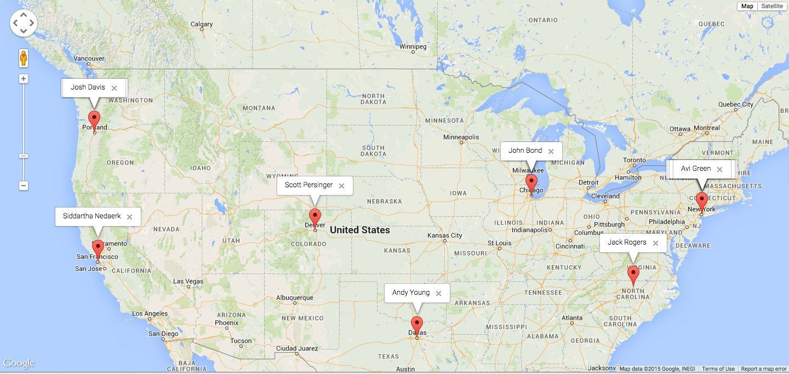

# Contact Mapper

This is a very basic demonstation app for [Heroku Connect](https://www.heroku.com/connect). It is based
on the [Heroku Node starter app](https://github.com/heroku/node-js-getting-started).

The application relies on Heroku Connect to sync Contact records into Postgres. We load contact
records from the db, then use the Google Geolocation API to geocode the address so we can locate
each contact proerly on the map.

For better performance geocoded addresses are stored back in our database so we only have to look
them up once.



## Install

Use the Heroku Button below to clone the app:

[](https://heroku.com/deploy?template=https://github.com/scottpersinger/contactmap-demoapp)

## Provision Heroku Connect

Click on the Heroku Connect addon on your new app to access the Heroku Connect dashboard.

Add a mapping for the `Contact` object in Salesforce, and select these fields:

```
Name
Email
MailingStreet
MailingCity
MailingState
```

That's it! Once the data is synchronized just reload the Contact Map app to see 200
Contact records placed on a Google Map of the United States.

## Understanding the app


